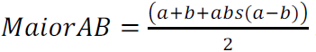

# O Maior

## Descrição

Faça um programa que recebe três valores e apresente o maior dos três valores lidos. **_Utilize a fórmula_**:



## Input

Três valores inteiros.

## Output

Imprima o maior dos três valores.

## Exemplos

```python
a = 1
b = 5
c = 7

# your code here

""" expected output:
7
"""
```

<details>
    <summary>Resposta</summary>
<p>

```python
a = 1
b = 5
c = 7

largestNum = (a + b + abs(a - b)) / 2
largestNum = (c + largestNum + abs(c - largestNum)) / 2

print(largestNum)
```

</p>
</details>
